% バグ修正確認botの紹介とjq
% yamotonalds
% 2016-04-20

# 目次

## バグ修正確認bot

- 生まれた経緯
- 機能
- 気をつけたこと
- 結果

## jq

- jqとは
- 基本的な使い方
- 応用的な使い方？
- 実際のコード

# バグ修正確認botの紹介

## 生まれた経緯

. . .

元々オクダムbotがいた。

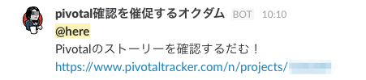

. . .

⇒ 誰も見なかった。

##

エンジニアKPTのPに上げられた。

. . .

⇒ 個別にチケットを羅列すれば確認するのでは？(T)

##

Tになったけどエンジニアは忙しくて

（bot慣れしてなくて？）

作ってくれない…

. . .

🐼 > 定時後に作ろう

##

2016-03-23

. . .

バグ修正確認bot誕生

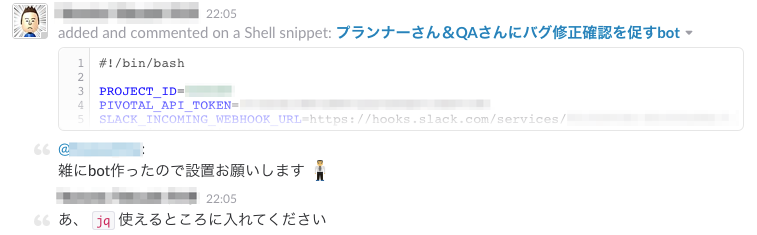

##

2016-03-25

. . .

リマインド

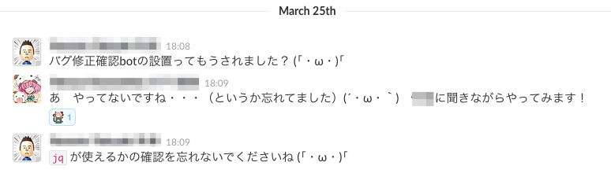

##

2016-03-30

. . .

リマインド（2回目）

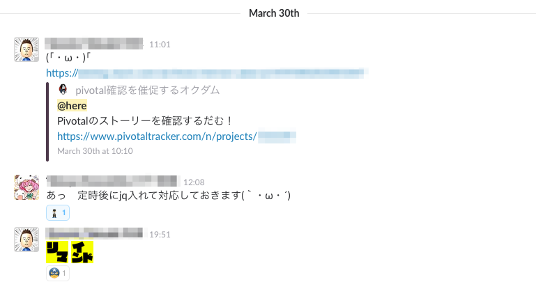

##

2016-03-31

. . .

初回華麗にバグる

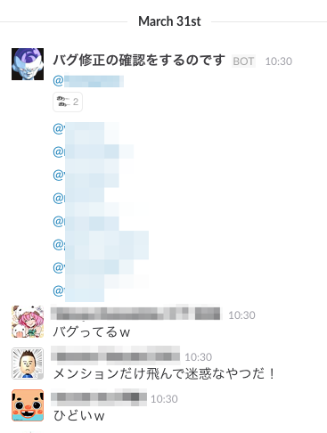

##

これには皆さんご立腹

##

手動ではうまく行ってたのになぜ？

. . .

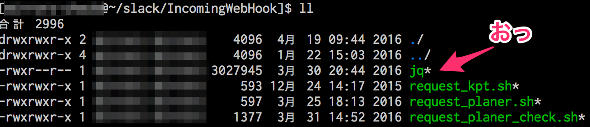

. . .

cron時にPATH通ってない `(^q^)`

##

改めて実行

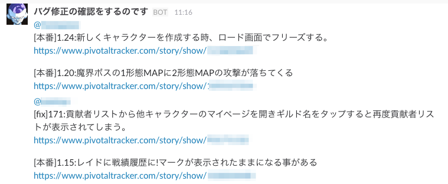

##

早速ダメ出しを食らう

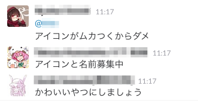

##

和やかに話が弾む

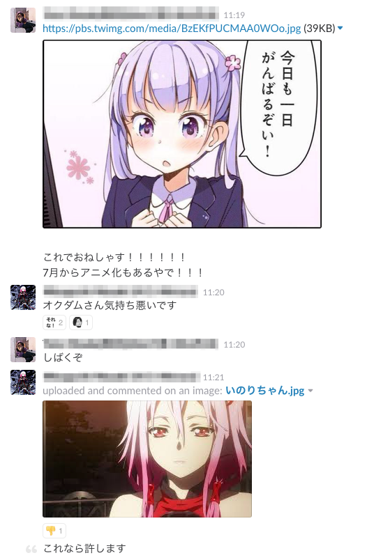

##

まとまりそうにないなーと思ったそのとき

. . .

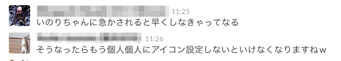

. . .

🐼 > なるほど？

##

バグ修正確認BOT希望記入シートが作られる

. . .

みんなの投票はバラバラ

. . .

🐼 > やはり個別設定か

##

2016-04-07

. . .

個別設定で動き始める

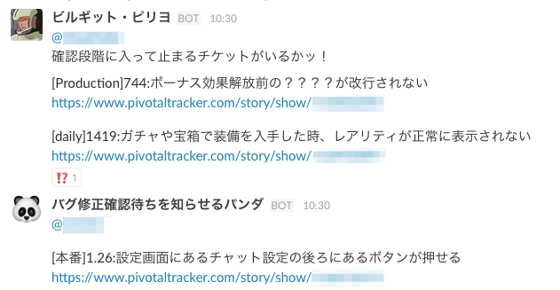

##

喜びの声

. . .

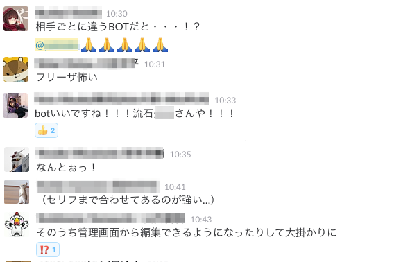

##

要望も出てくる

##

要望シートのグレードアップ

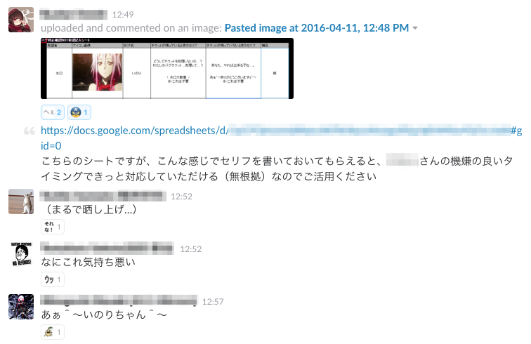

##

仕事に対する意欲向上

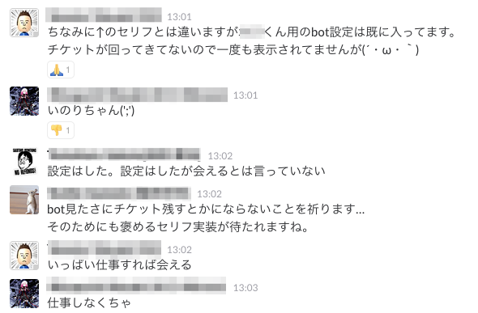

##

2016-04-12

チケットをためていない場合にほめる機能実装

. . .

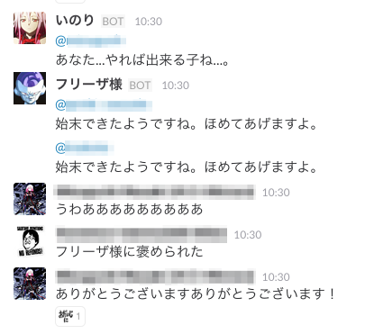

##

さり気なくアニメ化の宣伝も

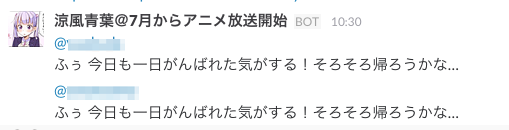

##

2016-04-13

. . .

Redmineに対応

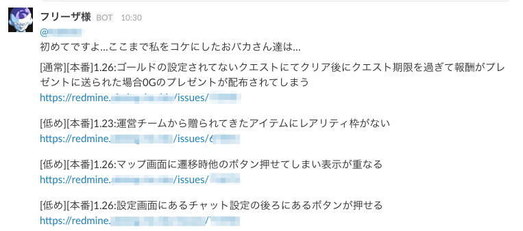

優先度順表示も実装

##

水□くんの愛

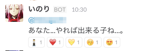

. . .

（↑のリアクションは全部水□くんです）

##

2016-04-15

新たな仲間も加わり

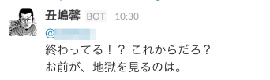

##

バグ修正確認botはこれからも改良されながら

プロジェクトに貢献していきます 🐼

# ｊｑについて

##

思いの外botの話が長くなったので省略します `(^q^)`

. . .

時間があればbotのコードを少し眺めて終わりにしましょう。

